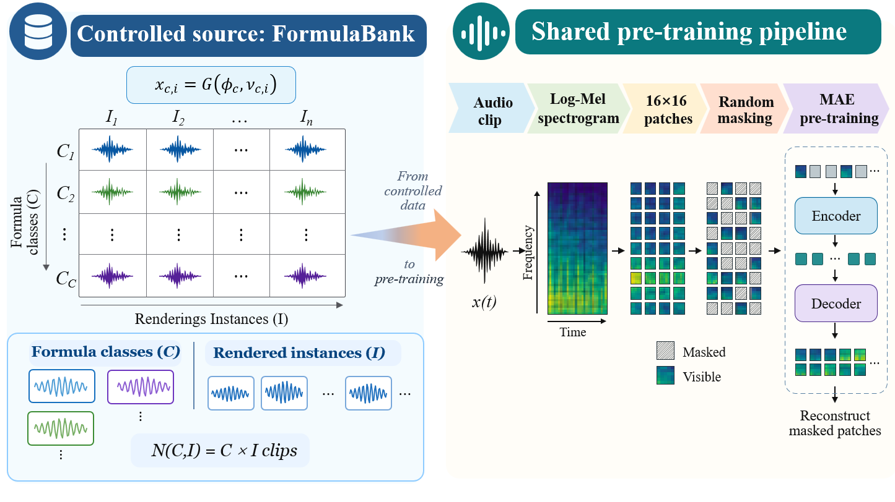

<div align="center">

# Rethinking Procedural Audio Pre-training: Source Scaling and Objective Adaptation

[](https://huggingface.co/datasets/KevinJustin/FormulaBank-28K)

</div>

This repository contains the official implementation of **Rethinking Procedural
Audio Pre-training: Source Scaling and Objective Adaptation**. It studies how
the scale and statistics of a procedural audio source affect self-supervised
audio representation learning.



FormulaBank separates formula-class coverage $C$ from rendering diversity $I$:

$$
x_{c,i}=G(\phi_c,\nu_{c,i}), \qquad N(C,I)=CI.
$$

The repository supports AudioMAE pre-training on procedurally rendered audio,
matched AudioSet-28K controls, and transfer to ESC-50, UrbanSound8K, FSD50K,
Speech Commands v2, and AudioSet-20K.

## Contents

- [Quick start](#quick-start)
- [FormulaBank-28K dataset](#formulabank-28k-dataset)
- [Repository layout](#repository-layout)
- [Training and evaluation](#training-and-evaluation)
- [Method and reported results](#method-and-reported-results)

## Quick start

The code is developed with Python 3.10, PyTorch, and CUDA. Install a PyTorch
and torchaudio build that matches your CUDA runtime, then install the remaining
Python dependencies.

```bash
git clone https://github.com/KevinJustin-love/Formula-Bank.git
cd Formula-Bank

conda create -n formula-bank python=3.10 -y
conda activate formula-bank

# Choose the PyTorch wheel that matches your CUDA version.
pip install torch torchaudio --index-url https://download.pytorch.org/whl/cu118
pip install -r requirements.txt
```

Run a small procedural AudioMAE smoke experiment. The procedural source is
rendered on the fly, so this command does not require a downloaded audio corpus.

```bash
python pretrain.py \
  --models tiny \
  --epochs 1 \
  --epoch-len 64 \
  --batch-size 8 \
  --output-dir runs/smoke \
  --no-amp
```

For a normal AudioMAE run, choose a synthesizer configuration and model size:

```bash
python pretrain.py \
  --models base \
  --epochs 500 \
  --epoch-len 5000 \
  --synth-config configs/synth/baseline_current.json \
  --output-dir runs/formulabank_base
```

Check the complete options for any entry point with `python <script> --help`.

## FormulaBank-28K dataset

[FormulaBank-28K](https://huggingface.co/datasets/KevinJustin/FormulaBank-28K)
contains 28,000 deterministic procedural clips: 125 formula classes and 224
renderings per class. Each clip is mono, 16 kHz, 10.24 seconds, and stored as
lossless FLAC. The dataset repository also includes per-clip metadata and the
frozen class-selection manifest.

Download it with the Hugging Face CLI:

```bash
pip install "huggingface_hub[cli]"
huggingface-cli download KevinJustin/FormulaBank-28K \
  --repo-type dataset \
  --local-dir data/FormulaBank-28K
```

The downloaded corpus is useful for corpus analysis, frozen-source experiments,
and reproducing the published FormulaBank-28K data release. It is intentionally
excluded from this Git repository; see [`.gitignore`](.gitignore).

## Repository layout

```text
Formula-Bank/
├── pretrain.py                  # On-the-fly procedural AudioMAE training
├── pretrain_mae.py              # Frozen FormulaBank AudioMAE protocol
├── pretrain_mae_fdsl.py         # FDSL-style FormulaBank AudioMAE protocol
├── pretrain_mae_audioset.py     # Matched AudioSet-28K AudioMAE control
├── pretrain_sl.py               # FormulaBank definition and shared components
├── pretrain_sl_fdsl.py          # FDSL-style supervised pre-training
├── esc_refer.py                 # ESC-50 full fine-tuning
├── us8k_refer.py                # UrbanSound8K full fine-tuning
├── fsd50k_refer.py              # FSD50K full fine-tuning
├── scv2_refer.py                # Speech Commands v2 full fine-tuning
├── audioset20k_refer.py         # AudioSet-20K full fine-tuning
├── audioset20k_dataset.py       # AudioSet-20K tar-shard dataset reader
├── byola_v2_compatible.py       # BYOL-A v2 procedural pre-training adapter
├── byola_v2_finetune.py         # BYOL-A downstream fine-tuning
├── official_ssl/                # SSAST and PaSST adapters
├── configs/synth/               # Procedural source configurations
├── scripts/                     # Entropy-analysis utilities
└── external/                    # Minimal upstream model dependencies
```

## Training and evaluation

### FormulaBank and AudioSet-28K pre-training

`pretrain.py` is the simplest entry point for procedural AudioMAE training.
`pretrain_mae.py` and `pretrain_mae_fdsl.py` implement the frozen FormulaBank
protocols and require a FormulaBank JSON manifest plus a selected subset. The
matched real-audio control uses a local AudioSet-28K WebDataset-style corpus:

```bash
python pretrain_mae_audioset.py \
  --audioset-root data/AudioSet-28K \
  --train-manifest data/AudioSet-28K/train_manifest.jsonl \
  --audit-manifest data/AudioSet-28K/audit_manifest.jsonl \
  --mask-ratio 0.75 \
  --output-dir runs/audioset28k_m075
```

### Downstream fine-tuning

Pass an encoder or MAE checkpoint with `--pretrained`. The commands below use
the published evaluation protocols: ESC-50 fold 1, UrbanSound8K fold 10, and
the official FSD50K split.

```bash
python esc_refer.py \
  --model_size base \
  --fold 1 \
  --pretrained runs/formulabank_base/vit_base/final.pth

python us8k_refer.py \
  --model_size base \
  --fold 10 \
  --pretrained runs/formulabank_base/vit_base/final.pth

python fsd50k_refer.py \
  --model_size base \
  --pretrained runs/formulabank_base/vit_base/final.pth
```

Speech Commands v2 and AudioSet-20K use their dedicated entry points:

```bash
python scv2_refer.py \
  --data-path data/speech_commands_v0.02 \
  --pretrained runs/formulabank_base/vit_base/final.pth

python audioset20k_refer.py \
  --data-path data/AudioSet \
  --pretrained runs/formulabank_base/vit_base/final.pth \
  --output-dir runs/audioset20k_ft
```

### Other objectives and analysis

The repository includes adapters for BYOL-A, SSAST, and PaSST. Their entry
points are `byola_v2_compatible.py`, `official_ssl/train_ssast.py`, and
`official_ssl/train_passt.py`. The `scripts/` directory provides paired-source
and patch-codebook entropy analyses used in the paper.

## Method and reported results

We independently vary class coverage and rendering diversity:

$$
I=125,\quad C\in\{14,28,56,112,224\},
\qquad
C=224,\quad I\in\{16,32,64,125,250,500,1000\}.
$$

The same FormulaBank source supports several pre-training objectives. Each
method uses its native encoder and full downstream fine-tuning protocol.

| Method | Encoder | ESC-50 | US8K | FSD50K | SCv2 | AS-20K |
| --- | --- | ---: | ---: | ---: | ---: | ---: |
| AudioMAE | ViT-B | 86.25 | 85.78 | .5649 | 97.77 | .241169 |
| BYOL-A | AudioNTT2022-CNN | 75.00 | 76.82 | .4660 | 96.70 | .152646 |
| SSAST | ViT-B | 81.00 | 81.36 | .5167 | 96.72 | .199608 |
| PaSST-noImageNet | ViT-B | 75.50 | 77.66 | .5156 | 96.81 | .179001 |
| Scratch | ViT-B | 69.50 | 73.36 | .4090 | 96.74 | .136188 |

For matched AudioMAE experiments, FormulaBank performs best with low mask
ratios ($.10$ -- $.25$), whereas AudioSet-28K favors moderate-to-high masking
($.50$ -- $.75$). This supports adapting the pre-training objective to source
statistics.

## License

The repository retains the licenses of the included minimal upstream
dependencies under `external/`. The FormulaBank-28K dataset license is stated
on its Hugging Face page.
